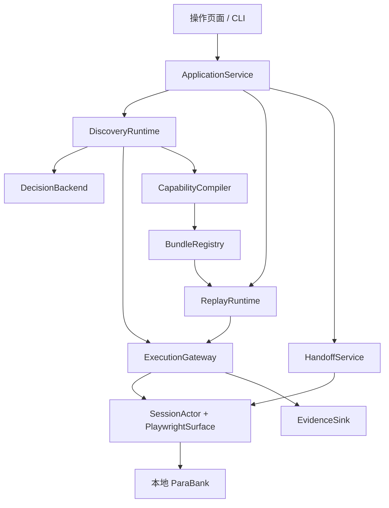

# Computer-Use Automation：系统设计 Spec

版本 1.0 · 2026-09-21 · 配套执行文档：`Codex_Execution_Playbook_Computer_Use.md`。

本文件规定组件、接口、数据契约和关键算法。执行文档规定业务场景、实施顺序和最终验收。两份一起交给 Codex；本 Spec 替代旧 `Implementation_Design_v1` 的技术方案，不恢复已取消的 Staff Console、第二套后端或开户流程。这里是待实现设计，不是测试已通过的声明。

## 1. 设计目标与明确选择

实现自己的 capability runtime：模型发现如何操作 UI，编译器把成功轨迹转换成可审查能力，replay 无模型执行，异常交给同会话人工处理。

主能力为 `get_savings_balance(account_id)`。调用上下文绑定 `session_id`、目标实例和预期客户身份；这些不是模型可以修改的业务参数。主目标为本地 ParaBank 原生客户网银，操作页面是我们自己的控制入口，两者是不同应用。

| 决策 | 首版实现 |
|---|---|
| 应用结构 | Python 3.12 模块化单进程，FastAPI + 简单 HTML/JS，CLI 共用服务层 |
| 浏览器 | Playwright Chromium，每个客户独立非持久 BrowserContext；本机 headed 演示、headless CI |
| 决策 | provider-neutral structured-output LLM，只用于 discovery；首版只实现一个实际可用 provider |
| 自研核心 | observation/action contracts、policy gateway、trace compiler、bundle registry、replay、handoff、evidence |
| 存储 | SQLite 保存脱敏元数据，YAML/JSON 保存 bundle，JSONL 保存安全事件 |
| 目标应用 | 本地固定版本 ParaBank；Compose 只负责目标应用，runtime 和 headed 浏览器在 host |
| 模型替换 | Jev/Laya 只保留适配接口，首版不引入其服务、GPU、Browser Harness 或概率路由 |
| 不做 | 转账/开户自动化、任意代码 DSL、分布式调度、远程桌面流、生产多租户、桌面 adapter |

### 1.1 Jev 与 Laya 的思路怎样进入本系统

2026-09-21 查阅的官方来源：[Jev Ultrafast](https://github.com/browser-use/jev-ultrafast)、[Laya](https://github.com/NandhaKishorM/laya)。下表的右列是我们的设计决定，不是它们已经提供了本项目全套能力。

| 来源 | 可借鉴的机制 | 在本系统的落点 |
|---|---|---|
| Jev Ultrafast | 从当前页面生成带索引的可操作元素集合；按动作类型限制目标 | `ObservationBuilder` + `ActionSpaceBuilder` |
| Jev Ultrafast | 执行动作前检查页面 freshness、目标和遮挡；重新观察 | `SurfaceAdapter.resolve_observed()` + `ExecutionGateway.dispatch()` |
| Jev Ultrafast | 页面状态与选择动作分离；DONE 仍需独立验证 | `DecisionBackend` 与 `CompletionVerifier` 分离 |
| Laya | 在有限选项上输出 typed choice/score/boolean 决策 | `DecisionBackend.choose()` 返回受约束的 `Decision`，不返回代码 |
| 我们的核心 | 将观察轨迹编译成可复用、可批准、可验证的能力 | `CapabilityCompiler` + `BundleRegistry` + `ReplayRuntime` |

Jev Ultrafast 当前默认环路使用结构化页面状态，另有 TypeSafe 决策及文本生成路径；它不是本设计中 Playwright 的别名。其文档列出 frames 等尚不覆盖的范围，不能复制后宣称自动支持。Laya 是决策模型项目，不是浏览器 runtime；其文档也提示领域适配与校准限制。首版不采用它们的速度、价格或置信度数字作为本项目指标，不用模型 confidence 替代身份校验和授权。

实现时可阅读 Jev 的 `agent.py`、`browser.py`、`model.py`、`snapshot.js` 理解边界，但不要整套复制。若实际复用代码，固定来源 revision 并保留相应许可证；Jev 仓库为 MIT，Laya 仓库为 Apache-2.0。

## 2. 系统边界与依赖方向



- `ApplicationService` 组织用例，拥有后台 task 引用；HTTP 请求结束不能销毁正在运行的浏览器任务。
- discovery 和 replay 都经同一个 gateway 操作页面；replay 的构造器不能接受模型客户端。
- SessionActor 串行化该会话的观察、动作和控制权转移。模型网络请求在 actor 外等待，回来时重新检查 epoch/freshness。
- target profile 定义页面识别、安全控件类别与业务条件，不提供一串预写 discovery 动作。
- fixture setup、fault injector、ground-truth evaluator 在测试侧；运行时不得导入这些模块、读其 DB 或调用其 API。
- 本地目标网页自身请求 API 属正常渲染；runtime 不读响应体、不自行请求业务 API取得答案。

## 3. 模块与方法合同

以下是应实现的方法语义，类型名在 §4 定义。可以合并文件，不能绕过职责边界。

| 模块 / 类 | 核心方法 | 责任与输出 |
|---|---|---|
| `app.ApplicationService` | `start_discovery(req) -> RunHandle`；`invoke(req) -> RunHandle`；`get_run(id) -> RunView`；`read_result(id, caller) -> InvocationResult` | 校验调用者、输入、session，分配 run，启动任务，不直接访问 DOM |
| `sessions.SessionManager` | `prepare(target_id, principal_ref) -> SessionHandle`；`get(session_id)`；`reauthenticate_existing(session_id, expected_epoch)`；`close(session_id)` | 环境凭据经 UI 登录、绑定客户、创建隔离 context；不把密码传给模型 |
| `sessions.SessionActor` | `submit(command, expected_epoch)`；`request_pause(reason)`；`claim(token, epoch)`；`resume(token, epoch)` | 一个 session 一条串行控制路径；单活跃 run；在途 drain 与 fencing |
| `surface.PlaywrightSurface` | `observe(session) -> Observation`；`resolve_observed(ref) -> ResolvedControl`；`resolve_target(spec, bindings) -> ResolvedControl`；`execute(action, control) -> EffectReceipt` | 观察 DOM、frame、visible text；唯一定位、actionability、执行；不决定业务授权 |
| `discovery.ObservationBuilder` | `build(raw_view, bindings) -> Observation` | 一次有界采样、控件编号、敏感别名、document generation；不将完整 DOM 交给模型 |
| `discovery.ActionSpaceBuilder` | `build(observation, policy) -> ActionSpace` | 每种 operation 对应允许 control_refs，操作与控件兼容 |
| `discovery.GoalBinder` | `bind(goal, supplied_inputs) -> BoundIntent` | 提取并验证 account_id，保存本地绑定，生成脱敏 goal；缺失/冲突返回 INPUT_INVALID |
| `llm.DecisionBackend` | `choose(request) -> Decision` | 模型只选动作与当前 control_ref，可提出 DONE/BLOCKED；返回短 rationale 与真实 usage |
| `discovery.DiscoveryRuntime` | `run(context, intent) -> DiscoveryOutcome` | 有界 observe/decide/dispatch/verify 环路和轨迹，不直接执行模型输出 |
| `policy.PolicyEngine` | `authorize(context, action, control) -> Authorization` | deployment ∩ capability ∩ run 权限；unknown risk 拒绝；审批不扩权 |
| `execution.ExecutionGateway` | `dispatch(context, request) -> StepResult` | actor 内复核 ownership/freshness/policy，执行并确认效果；统一安全事件 |
| `conditions.ConditionEvaluator` | `evaluate(condition, view, context) -> ConditionResult` | 固定 DSL 解释器，PASS/FAIL/UNKNOWN；不运行模型或动态代码 |
| `verification.CompletionVerifier` | `verify(contract, view, context) -> VerificationResult` | 检查 session、账户成员关系、账户类型、字段、输出，最终批准 SUCCESS |
| `compiler.CapabilityCompiler` | `compile(trace, contract, profile) -> DraftBundle`；`check(bundle) -> Findings` | 转换 observed actions、绑定参数、关联来源、闭合依赖，拒绝无成功轨迹 |
| `registry.BundleRegistry` | `put_draft(bundle)`；`validate(ref, test_session) -> ValidationReport`；`approve(ref, reviewer)`；`load_approved(ref) -> Bundle` | immutable revisions、canonical digest、验证、批准、兼容性检查 |
| `replay.ReplayRuntime` | `run(bundle, context, inputs) -> InvocationResult` | 固定步骤、条件、提取、恢复和升级，不使用模型 |
| `handoff.HandoffService` | `request(run, reason)`；`claim(id, token, epoch)`；`resume(id, token, epoch)`；`abort(id, token)` | API 适配 actor，介入记录和恢复 reconciliation |
| `evidence.EvidenceSink` | `emit(SafeEvent)`；`capture_safe(view) -> EvidenceRef`；`finish_manifest(run)` | 只接收安全结构，无法安全采集就保存安全替代，不兜底写 raw data |

所有 public methods 对预期业务/输入错误返回 typed result；内部异常在边界转换为脱敏 `FailureDetail`，不把 exception 原文、URL query 或请求体落日志。

## 4. 数据模型与存储

### 4.1 运行请求与结果

```python
class DiscoveryRequest:
    target_id: str
    session_id: str
    goal: str                         # sensitive, memory-only
    inputs: dict[str, str]            # optional account_id hint

class InvokeRequest:
    capability: str                   # get_savings_balance
    version: str                     # explicit revision, UI may choose latest approved
    session_id: str
    inputs: dict[str, str]            # account_id required
    request_id: str                   # duplicate submission protection, not banking exactly-once

class RunContext:
    run_id: str
    mode: Literal['DISCOVERY', 'VALIDATION', 'REPLAY']
    session_id: str
    expected_epoch: int
    principal_binding: PrincipalBinding  # server-owned, cannot be overwritten by request
    input_bindings: SecretBindings      # memory-only actual values
    deadline: MonotonicDeadline

class InvocationResult:
    run_id: str
    status: Literal['SUCCESS', 'BUSINESS_OUTCOME', 'FAILURE', 'ABORTED']
    outputs: dict | None              # only SUCCESS; memory-only sensitive values
    code: str | None
    failure: FailureDetail | None
    evidence_refs: list[str]

class RunView:
    run_id: str
    state: str                       # may be WAITING_FOR_HUMAN, not terminal result
    current_step: str | None
    outcome_code: str | None
    intervention_id: str | None
    safe_summary: str
```

`SUCCESS.outputs = {available_balance: decimal_string, currency: 'USD'}`。不成功时 `outputs=None`。`GET run` 只返回安全状态；授权调用方从独立 result endpoint 读取敏感结果。两者都以 `Cache-Control: no-store` 返回，result 不进入 SQLite。进程退出后结果不恢复，UI提示重新运行。

输入错误在创建 run 前返回 `INPUT_INVALID`。未知或不属于调用方的 session 不访问 UI。有效 session 已失去浏览器则运行失败 `SESSION_LOST`；认证过期则介入，不自动切换用户。

`request_id` 在 session 内映射到已启动 run，重复相同安全请求指纹返回相同 run_id；同 ID 不同内容返回冲突。指纹用运行时密钥 HMAC，不用裸哈希暴露低熵账户号；进程重启后去重边界失效并明确记录。

### 4.2 Observation、control 和 decision

```python
class Observation:
    id: str
    session_id: str
    page_id: str
    document_generation: int
    frame_generations: dict[str, int]
    captured_monotonic_ms: int
    safe_route: str                   # named route, query scrubbed
    state_tags: list[str]
    controls: list[ObservedControl]
    safe_text: list[str]
    fingerprint: str                 # runtime-owned relevance fingerprint

class ObservedControl:
    ref: str                        # unique within observation, e.g. c_7
    frame_ref: str
    role: str
    safe_name: str
    enabled: bool
    visible: bool
    allowed_operations: list[str]
    binding_ref: str | None          # e.g. inputs.account_id, not actual value

class Decision:
    observation_id: str
    operation: Literal['CLICK', 'TYPE_TEXT', 'SELECT', 'SCROLL', 'WAIT', 'DONE', 'BLOCKED']
    control_ref: str | None
    value_ref: str | None            # input/approved constant; no arbitrary generated account ID
    option_ref: str | None           # SELECT must refer to observed option
    reason_code: str
    rationale: str                  # short action explanation, sanitized before storage
```

Python 实现用 Pydantic discriminated unions 表达不同操作的必填/禁填字段，而非让上述所有字段任意组合。额外字段拒绝；type/select 的目标必须允许对应操作。`DONE/BLOCKED/WAIT` 不接受 control_ref。

本能力不需要自由文本生成。GoalBinder 在本地识别唯一 account_id，若 supplied input 与自然语言冲突则拒绝；识别失败请用户补该参数，不让模型猜。模型收到 `account_id = <requested_account>`；对应页面标签显示同一别名，点击时 runtime 用本地映射绑定真实值。没有凭据、raw account ID 或余额进入模型提示词。未来自由文本字段可以有单独 TextValueProvider，但不是首版依赖。

### 4.3 Session 与身份

`SessionHandle` 包含 session_id、target_id、内存 BrowserContext/Page、principal_ref、owner、epoch、active_run_id、authentication_generation。每客户独立 context，不共享 cookies/storage，不启用 persistent profile。

SessionManager 通过受控 UI 登录建立 PrincipalBinding：凭据引用、合成客户唯一可见标识、authentication_generation；该绑定仅服务端设置。检查 visible greeting 只能作为弱证据，必须结合受控登录 provenance 和本会话账户列表成员关系，不声称姓名能唯一证明身份。

任何 logout/login 页面、认证 cookie 变化（仅内存判断，不保存值）、异常导航或人工重新认证使 membership proof 失效。resume 如不能重新证明原身份，就保持暂停，要求同一 context 下受控重新登录原客户；不能只因余额页仍存在就通过。测试中使用可区分的合成身份，不把这种假设扩展为真实银行强认证。

`MembershipProof`：session_id、authentication_generation、account_binding_ref、overview observation ID、单调时钟时间；仅本次 run 内有效。进入详情前从完整的 overview 获取，完成前检查 generation 未变、当前 account number 匹配；handoff 后重新观察验证，必要时回到 overview。

### 4.4 持久化最小表

| 表 | 保存字段 | 不保存 |
|---|---|---|
| runs | run_id、mode、state、capability/version、safe target/session alias、step、code、timestamps、evidence refs | goal、account_id、余额、原始结果 |
| interventions | id、run_id、state、reason_code、epoch、safe summary、human event refs | 操作输入、认证 token |
| approvals | bundle digest、revision、reviewer ID/type、validation refs、time | 业务数据 |
| bundles | capability/version、digest、relative path、lifecycle | session-specific bindings |

会话句柄、operator tokens、input/output bindings 放内存。启动时把上次未终结 run 标为 `SESSION_LOST`，不重建 session 冒充 resume。SQLite 是记录，不是浏览器 checkpoint。

## 5. ParaBank target profile 与状态识别

先核实所选部署版本。已检查本地源码中的 `overview.jsp`、`activity.jsp`：账户列表含账户链接；详情含 account number、type、balance、available balance。该版本的 Available Balance 是 `max(balance, 0)`。执行前仍需以固定版本实测，不能把已读取源码写成已跑通。

### 5.1 Profile 内容

`profiles/parabank.yaml` 定义 origin、命名 routes、页面条件、logical targets、只读动作上限、USD 格式及parser版本。profile 不能包含账号、密码、余额、fault scenario 或预先排好的 discovery 步骤。

| Logical target | 首选定位策略 | 约束 |
|---|---|---|
| overview_nav | exact role=link name=Accounts Overview | 限定已登录导航区域、唯一匹配 |
| account_table | 原生账户表格与 Account 列 | 可用经审查的 `#accountTable`，同时验证标题和列，不依赖新 test ID |
| requested_account_link | 表格 Account 列中 exact text 绑定 account_id 的 link | 所有匹配计数必须等于 1，不从模型接受 selector |
| detail_account_id | Account Details 区域的 Account Number 对应 value | ID `#accountId` 可作固定 fallback，但必须核对字段关系 |
| detail_account_type | 同区域 Account Type 对应 value | SAVINGS 精确归一化匹配 |
| detail_available_balance | 同区域 Available Balance 对应 value | 与 Balance 区分，拒绝多个可见值 |

这些是业务字段 grounding，模型仍要观察并选择何时访问 overview、选哪个可见控件；不得把整个 replay 步骤列表作为 discovery prompt。新增/修改 locator 由 compiler 根据实际观察提出，审核后进入 bundle，不由模型直接执行任意 CSS。

### 5.2 NormalizedView 与 readiness

adapter 用已审查的 profile 从当前可见 DOM 产生 NormalizedView，具体原始字符串只在内存：

- state：`AUTHENTICATED_HOME / OVERVIEW_LOADING / OVERVIEW_READY / DETAIL_READY / LOGIN / APP_ERROR / ACCESS_DENIED / UNKNOWN`；
- current identity signals、完整账户集合、详情 ID/type/available balance；
- visible blockers、可操作控件、frame 路径与 generation；
- ready_evidence：用于证明页面已完成，而非简单“出现了表格”。

OVERVIEW_READY 要求正确标题/列、总计或固定版本验证过的完成标记、无 loading/error，并在两个相邻采样中集合稳定。这里稳定只是附加条件，不独立证明请求完成。首版合成客户都至少有一个账户，只有完整列表已成立才允许返回 ACCOUNT_NOT_FOUND；无法证明完整加载则 UNKNOWN/timeout，不把空白页面解释成不存在。

DETAIL_READY 要求账户编号、类型、Available Balance 对应值全部存在且可解析，没有可见错误。页面显示框架存在但值尚未填入时仍是 loading。不读取 JS 内部 model.customerId、响应 JSON 或网络 body 来绕过 UI。

### 5.3 固定的错误语义

- INPUT_INVALID：缺 account_id、非约定数字字符串、未知 session；不执行 UI。
- ACCOUNT_NOT_FOUND：完整 overview 中无匹配；仅表示当前客户的列表里没有。
- ACCESS_DENIED：必须有明确可见拒绝信号；原生 generic error 不足以推出该业务结果。该分支允许测试侧注入明确页面信号并标注。
- SUBJECT_MISMATCH：错误 principal binding 或详情 account ID，不返回任何输出。
- ACCOUNT_TYPE_MISMATCH：匹配账号不是 SAVINGS；硬失败，不能读 checking 值冒充。
- TARGET_AMBIGUOUS / AMBIGUOUS_STATE：多目标或冲突条件，硬失败。
- SESSION_EXPIRED、未知阻塞：请求介入；无浏览器则 SESSION_LOST。
- 短暂 loading/app error：只在已声明的安全恢复范围内重试，到总预算后 RECOVERY_EXHAUSTED。

## 6. Discovery 算法

1. `GoalBinder.bind()` 获取经过验证的 account_id 和脱敏目标。SessionManager 校验绑定，ApplicationService 锁定一个 run。
2. actor 中 observe：页面/frames 内有界采样，生成本次 observation 与节点引用映射；runtime 只保留最新映射及编译所需安全轨迹。
3. ActionSpaceBuilder 过滤未授权或不兼容操作。例如 CLICK 只能指向可点击且风险允许的控件；转账链接不进入可执行集合。
4. actor 外向 DecisionBackend 发出一个 structured request，包含脱敏目标、当前状态/控件及最近最多 5 步安全摘要。模型可提议 BLOCKED。
5. 本地 schema 校验、control/action 联合校验；非法输出不执行，记录 rejection。模型重问也计入 20 次预算。
6. gateway 在 actor 中复核 epoch、observation/document/frame、目标仍存在、可见、enabled、可操作且没有遮挡；检查相关 fingerprint 未变。
7. 相关状态失效返回 STALE_OBSERVATION，重新观察决策，不将旧编号套到新控件。纯动画无需全页强相等，相关字段变化、导航或文档替换必须失效。
8. 执行动作并观察结果，记录 effect state、前后条件与 source event IDs。所有输出提取通过固定 parser，模型不提供余额。
9. DONE 调用 CompletionVerifier；条件未成立则不成功，可继续剩余预算或介入。成功产生 `VerifiedDiscoveryTrace`，交给 compiler。
10. timeout/max decisions/dead-end 创建介入或结构化失败；不能无限重问模型。等待人不占模型计算预算，另设人工等待超时，超时 ABORTED。

首版使用通用 structured-output LLM 实现 DecisionBackend，保留相同 `choose()` 接口，未来可将有限 operation/control choices 映射到 Jev/Laya。概率只可用于记录或选择是否继续探索，不授予动作权限、不判定 SUCCESS。

## 7. 能力契约、编译和批准

### 7.1 Bundle 是唯一执行输入

bundle 包含 contract、steps、targets、condition definitions、recovery、parser IDs/versions、compatibility、provenance 以及 target profile 的可执行部分。运行时只另提供 origin/secrets/更严格策略等环境配置，不能偷偷替换 locator 或 condition。

版本分开：schema_version 表示解释器兼容，capability_version 表示能力 revision。首版任何可执行内容变化都建立新 revision。限制最多 32 步、condition 深度 8、定位候选 3 个、每步安全重试 2 次，不支持任意循环、子程序或脚本。

### 7.2 Condition DSL

解释器返回 PASS/FAIL/UNKNOWN，并带安全 reason code。all/any/not 采用三值逻辑；UNKNOWN 不允许成功，也不能被 `not UNKNOWN` 变成 PASS。

| 节点 | 参数 | 语义 |
|---|---|---|
| `all` / `any` / `not` | 子条件 | 组合，深度受限 |
| `page_state` | enum | 与 NormalizedView 状态比较 |
| `principal_matches` | 无 | 当前受控绑定与 run 预期一致 |
| `overview_complete` | 无 | 当前 view 的完整加载证据成立 |
| `account_present` | input_ref | 完整列表包含指定账户；不完整返回 UNKNOWN |
| `membership_valid` | input_ref | 本次 run 的 MembershipProof 仍有效 |
| `field_equals` | logical target、input_ref 或 approved constant | 读取唯一可见字段并比较 |
| `parseable` | logical target、parser ID/version | 固定 parser 可解析，失败不取默认值 |
| `output_valid` | 输出名称 | 只验证本次运行提取结果类型，不接受历史输出 |
| `explicit_denial` | profile signal | 可见拒绝，不将通用错误误判为拒绝 |

named conditions 编译时展开/固定引用；未定义或循环引用拒绝。parser registry 首版仅 `USD_DECIMAL_V1`，处理美元符号、千分位和负数，限制长度，不接受 NaN/Infinity。非 USD 或含糊格式拒绝，不默认为 0。

### 7.3 主能力的执行图

| Step | 动作 | 前置与后置 | 来源 |
|---|---|---|---|
| open_overview | CLICK overview_nav；若已在完整 overview 可跳过 | principal_matches → OVERVIEW_READY | 点击来自 discovery；skip guard 为 declared/reviewer_added |
| verify_membership | ASSERT overview_complete + account_present；存 MembershipProof | 不存在则 ACCOUNT_NOT_FOUND；不完整不能给 not-found | declared business checkpoint |
| open_account | CLICK requested_account_link(account_id) | membership_valid → DETAIL_READY | observed，参数绑定来自输入 |
| read_available | EXTRACT detail_available_balance using USD_DECIMAL_V1 | principal + membership + ID + SAVINGS + parseable 全部成立 | 输出位置 observed，类型约束 declared |
| finish | VERIFY completion | 再次校验身份/账户/字段，返回结构化结果 | runtime-owned |

上表是我们的期望业务流程，用于设计/验证，不硬编码为 compiler 的输出模板。真实 discovery 的动作若不同但合法，应保留其可复用动作及证据；无效绕路可以删除并记录 review diff。原生首页若已在 overview，允许零次 open_overview 点击，不伪造 observed event。每次 invocation 都必须先建立新的 MembershipProof：入口不在 overview 时，经单独验证和批准的 overview anchor 归一化；即使 discovery 未点击该导航，也可由 reviewer 添加该入口步骤，来源标为 reviewer_added，并通过“从详情页再次调用”的测试，不能标为 observed。

### 7.4 序列化片段

以下展示结构，不是可直接批准的完整能力。执行产物必须包含前表所有需要的 target/condition 定义与真实来源 ID，不能复制这个片段伪装 discovery。

```yaml
schema_version: '1'
capability:
  name: get_savings_balance
  version: '1.0.0'
compatibility:
  profile: parabank-native-v1
  runtime_contract: cua-v1
contract:
  inputs:
    account_id: {type: string, pattern: '^[0-9]+$', sensitive: true}
  outputs:
    available_balance: {type: decimal_string, sensitive: true}
    currency: {type: string, enum: [USD]}
  business_outcomes: [ACCOUNT_NOT_FOUND, ACCESS_DENIED]
steps:
  - id: open_account
    kind: CLICK
    target_ref: requested_account_link
    preconditions:
      - {kind: membership_valid, input_ref: account_id}
    postconditions:
      - {kind: page_state, value: DETAIL_READY}
    recovery_ref: readonly_overview_anchor
    source:
      type: observed
      event_ids: [real_event_id_inserted_by_compiler]
```

### 7.5 编译算法

1. 要求 `VerifiedDiscoveryTrace.success=True` 和 completion proof，不能从单纯模型 DONE 编译可批准能力。
2. 取真正执行过且验证过效果的动作。WAIT 编译成有界 condition wait，不保存探索时的固定 sleep；不能泛化出从未验证的流程。
3. 通过 runtime binding provenance 将实际账户文本/链接参数转换为 `input_ref: account_id`。避免全文件字符串替换误把相同数字的其他含义一起改掉。
4. 从观察到的 node attributes、role/name、table relation 构造确定性 target candidates，绑定 frame scope。任何新策略先经过唯一性验证和 reviewer，不执行模型输出 selector。
5. 添加 declared success/error contracts；来源明确为 `declared` 或 `reviewer_added`，不伪称本次探索观察到了 denial/transient。
6. 解析所有引用，固定 parsers/profile/overrides，静态检查输入引用、类型、sensitive literals、权限上限与动作限制，输出 DRAFT。
7. 在隔离客户测试 session 中 Validation replay，不调用模型，使用不同输入并独立比较真值。没有 live trace 时仅允许开发测试草稿，不能作为正式 evidence。
8. 输出 validation report + review diff；通过后独立 reviewer 或操作员 approve。Approval 不改变执行内容。

### 7.6 Digest 与批准

将 executable bundle 转为 canonical JSON：key 排序、标准 UTF-8、金额保留字符串、拒绝非有限数；SHA-256 覆盖 schema/contract/steps/targets/conditions/recovery/parser versions/profile overrides。provenance 自身也保留在 bundle 的摘要中，防止来源与内容错配。approval 放单独 sidecar，以免自引用。

`ApprovalRecord = {digest, capability_version, reviewer_id, reviewer_type, validation_run_refs, runtime_version, approved_at}`。

runtime build / browser / target revision 写进 validation manifest，加载时兼容性变化使 qualification 失效，必须重新 validate。digest 只防止内容无意变化，不是密码学身份认证。可信本地 approval store 是本题边界。

生命周期：DRAFT → VALIDATED → APPROVED；任何 executable edit 新建 DRAFT revision。正常 invoke 仅接受 APPROVED；validation endpoint 只允许对已静态检查的 DRAFT 在隔离测试 session 运行，依然走 gateway 和部署策略，不能用于越权业务调用。

## 8. Replay 的执行顺序与恢复

```python
async def replay(bundle, context):
    if context.mode == "VALIDATION":
        registry.verify_draft_static_checks_and_test_session(bundle, context)
    elif context.mode == "REPLAY":
        registry.verify_approval_and_compatibility(bundle)
    else:
        raise InvalidExecutionMode()
    validate_inputs(context.input_bindings, bundle.contract)
    for step in bundle.steps:
        await check_session_owner_identity_and_deadline(context)
        view = await surface.observe(context.session_id)
        state = classify(view, step, context)
        if state.is_business_outcome:
            return result_without_outputs(state)
        if state.requires_human:
            await handoff_and_reconcile(context, step)
            # reconcile chooses NEXT, RETRY_SAFE, or REMAIN_PAUSED, not unconditional replay
            continue_according_to_reconciliation()
        await evaluate_required_preconditions(step, view, context)
        result = await gateway.dispatch(context, bind(step))
        await verify_effect_or_recover(step, result, context)
    return completion_verifier.verify_and_extract(bundle, context)
```

这是顺序示意，不能把 `continue` 当成跳过未完成步骤。实际 executor 使用显式 step_index 与 reconciliation decision；只有 postcondition 已验证才推进 index。

判断优先级：session/owner/policy/identity → 显式互斥错误 → 已声明业务 outcome → step precondition → 动作 → postcondition/extraction。多个矛盾终态命中则 AMBIGUOUS_STATE。未知状态不能走“默认成功”。

### 8.1 步骤与条件的执行合同

| Step kind | 执行方式 | 何时推进 |
|---|---|---|
| CLICK / TYPE_TEXT / SELECT / SCROLL | 经 gateway 定位、授权和输入；类型化后置条件检查 | postcondition 为 PASS |
| ASSERT | actor 内读取当前 view、求值；verify_membership 成功时建立 proof | 全部必要条件 PASS |
| EXTRACT | gateway 的只读路径检查 owner/policy/身份，然后使用固定 parser；不执行 UI 输入 | 读取及输出条件 PASS |
| VERIFY | CompletionVerifier 检查同一次当前 view 与有效 proof；输出必须等于此时重新解析的值 | completion PASS 才返回 SUCCESS |
| WAIT | 条件驱动的有界重新观察，无模型 | 目标条件 PASS；超时进入既定处理 |

所有动作前置条件只有 PASS 才执行。FAIL 按 §5.3 的显式映射产生业务 outcome、硬失败或声明的安全恢复；未声明 FAIL 映射则 CHECKPOINT_FAILED。UNKNOWN 先在该 step timeout 内等待/重新观察，超时后请求人工；目标丢失或 run deadline 已尽则结构化失败。FAIL/UNKNOWN 都不能推进 step_index。只有页面操作和受保护读取通过 gateway，ASSERT/VERIFY 不伪造浏览器点击。

### 8.2 Effect 状态

`NOT_DISPATCHED → DISPATCHED → VERIFIED`。动作已发出但效果无法确认标 `OUTCOME_UNKNOWN`。超时异常需保留这个区别，不直接把它转成“未执行”。

对本能力的安全只读 navigation：先观察是否已到目标详情；到了并且身份正确则视为完成，不再 click。否则可回 `readonly_overview_anchor`，重新读取当前账户集合、重新绑定输入，最多额外 2 次。anchor 只能是已批准 overview 只读导航，不能任意 reload 未知 POST 页面。

每个逻辑 step 的重试计数跨 anchor 恢复和 handoff 保留，不能重置规避上限；同时有每 run 总 deadline。持续故障最终 RECOVERY_EXHAUSTED。未知写动作本来就被 policy 阻止，测试用 fake adapter 注入副作用+丢回执验证不重复，无需实现真实转账。

### 8.3 零模型保证

ReplayRuntime 只依赖 registry/surface/gateway/conditions/evidence/handoff，无 DecisionBackend 参数。代码层 import 检查禁止 replay 引用 llm 模块；测试将所有 provider 入口替换为调用即失败的 trap，移除凭据运行正常/恢复/提取/完成路径。

记录真实 observed model call counters，不用固定填 0 证明。UI 的 Run Replay 必须启动 REPLAY mode，不能偷偷调用 discovery 的 self-heal。故障后需要新探索必须创建独立 discovery run 和新能力 revision，本次 replay 仍记录失败/介入。

## 9. 人工接管与控制权

### 9.1 状态转换

| 当前状态 | 操作 | 下一状态与保证 |
|---|---|---|
| RUNNING | request_pause | PAUSING，停止接受新自动动作 |
| PAUSING | 在途动作已结束或效果已标 unknown | WAITING_FOR_HUMAN，epoch 增加，owner=NONE |
| WAITING_FOR_HUMAN | 有效 claim | HUMAN_CONTROLLED，owner=operator，epoch 增加 |
| HUMAN_CONTROLLED | 有效 resume | RESUMING，停用人工控制请求、排空受控输入，epoch 增加；禁止普通 replay 动作，只允许下述恢复校验动作 |
| RESUMING | 验证 postcondition 已完成 | 标记 MANUALLY_COMPLETED，继续下一步 |
| RESUMING | 仍在安全 precondition | 当前步骤 RETRY_SAFE，保留预算 |
| RESUMING | 身份或状态无法证明 | 返回 HUMAN_CONTROLLED，保持暂停并给原因 |
| 任一非终态 | abort / session lost | ABORTED / FAILURE，清理任务和敏感内存 |

重复 claim、旧 epoch、错误 operator、非人控状态 resume 返回控制冲突，不二次移交。automation dispatch 和 control transition 在同一个 actor 顺序中完成，不能只在动作开始前读一次 DB lease 然后无锁点击。

pause 请求可以设置停止派发标志；当前 Playwright 操作受 timeout 约束，未确认其结束前不给人控制权。不安全地取消协程不代表浏览器动作已经停止。排空失败时保持 PAUSING 或终止 run，不假装已安全移交。

### 9.2 人工事件与恢复

对所有允许 frames 注入 runtime-owned event listener，只记录 owner=HUMAN 时的 click/select/type/navigation 元数据，不记录值、raw text或账号 URL。由于 Playwright 输入也可能是 trusted event，不能仅靠 `isTrusted` 区分人机，结合 owner/dispatch window 标记来源。

合作式本机环境无法拦截所有物理输入。发现 automation window 外的用户输入或未知导航时暂停；报告限制。真人 handoff evidence 必须由真人操作产生，自动 operator 测试只证明协议。

人工重新登录会使 authentication_generation 变化；不能继续沿用旧 MembershipProof。原客户重新受控认证、重新读取 overview 后才可恢复。

`reauthenticate_existing(session_id, expected_epoch)` 仅在 RESUMING 状态经同一 actor 调用，沿用原 BrowserContext/Page 和原 principal 的环境凭据，以受限 setup policy 进行 UI 登录，不新建 session、不允许调用方改身份。明确登录为另一用户时保持人控并给出拒绝原因，不静默执行换号。操作者主动选择“重新认证原客户并恢复”才进行该登录路径。RESUMING 允许已批准的只读 overview anchor 来重建 MembershipProof，普通 capability 动作仍禁止。恢复校验成功后更新 authentication_generation/proof，分配新的 automation epoch 并决定 NEXT/RETRY_SAFE；失败则增加 epoch、归还人控。真人点击 Resume 表示归还控制权；本机物理输入无法强制排空，若期间检测到新人工输入则停止恢复并归还人控。若人关闭窗口导致 context/page 丢失，标 SESSION_LOST，不创建新的 context 冒充同 session。

## 10. 安全与证据数据流

### 10.1 策略模型

TargetConfig 固定 origin（含 scheme/host/port）和命名只读 routes。主能力只允许经过 profile 分类的 overview/account detail navigation、读取、必要 scroll/wait；login 准备使用单独 setup policy，不与能力执行混用。

`allowed deployment ∩ bundle requested ∩ run session permissions`。所有 target/action 从 runtime 定位后重新分类，LLM 的 risk label 和 bundle 的 READ_ONLY 只是声明，不能决定权限。未知链接、写入按钮、外部 popup 默认拒绝。

规范化 route/path，校验 redirects 和新 page 事件，不将允许导航域等同完整 egress 隔离。网页正常静态资源及业务渲染请求允许在目标边界内；不要通过 response listener 把返回数据送入 verifier。强网络隔离不是首版承诺。

### 10.2 脱敏的四个出口

| 出口 | 可包含 | 必须移除 |
|---|---|---|
| 模型输入 | 目标意图、控件别名、当前状态、安全短摘要 | 凭据、raw account/member、余额、完整 DOM |
| SQLite/JSONL | event type、step、状态、reason code、时长、随机别名 | raw goal、输入/输出值、token、完整异常文本 |
| Screenshot/snapshot | 遮罩后的页面或白名单结构 | 未识别敏感区域、账号、姓名、余额、认证内容 |
| 授权 result/UI | 本次请求的 available balance、currency | 其他客户字段；禁止日志/URL/localStorage/持久缓存 |

对 low-entropy 身份不用裸 hash 脱敏，使用随机 per-run alias 或内存 HMAC。截图先确定 mask，未知页面默认安全结构快照；失败证据不能由于原始截图不可存就完全缺失。

证据结构建议：`evidence/<run_alias>/events.jsonl`、`manifest.json`、`failure.safe.json` 或 `failure.masked.png`。manifest 含 mode、code commit、bundle digest、target/browser/model versions、outcome、model call counts、tokens if available、fixture seed alias、source event refs。model response 不原样存，保留已验证的安全 decision 即可。

canary 检查覆盖运行目录、SQLite、事件、异常路径、临时文件和浏览器 profile；browser context 用完关闭，不导出 storage state。合成 seed 文件可显式保存测试输入，但不能因此豁免运行日志敏感字段；扫描时区分 seed 定义与 runtime 泄漏。

## 11. 操作页面、API 与 CLI

### 11.1 页面

FastAPI 提供同源静态 HTML + 少量 JavaScript，三个区域共用服务层：

1. **Run**：目标、已准备的客户 session、自然语言 goal、可选 account_id。启动后显示 run mode、当前步骤、耗时、状态和安全事件。控件不可重复启动同 session；等待态显示 intervention 链接。
2. **Capabilities**：draft/validated/approved 列表，展开 contract、steps、provenance、validation report；Validate 在隔离测试 session 执行；Approve 只对验证通过且 digest 未变的 revision；Replay 输入新的 session/account。
3. **Intervention**：原因、step、安全证据、当前 owner/epoch、浏览器窗口标识；Claim/Resume/Abort 按状态可用，显示 reconciliation 拒绝原因。

2 秒一次安全 status polling 即可，无需 WebSocket。结果通过独立授权 endpoint 读取，页面内存显示，离开/abort 清理。默认无分析埋点、浏览器持久缓存或请求 body 日志。

### 11.2 最小 API

| Method / route | 输入 | 输出 / 约束 |
|---|---|---|
| GET /api/sessions | 无 | 已准备 session 的安全 alias，不提供凭据 |
| POST /api/sessions | target_id、已配置 principal_ref | 经 setup policy 执行 UI 登录并建立 session；只接受服务端配置的凭据引用 |
| DELETE /api/sessions/{id} | operator auth | 串行 abort 活跃 run 后关闭 context 并清理内存，不直接杀在途动作 |
| POST /api/discovery | DiscoveryRequest | 202 RunHandle；同 session 活跃 run 返回 409 |
| POST /api/invocations | InvokeRequest | 202 RunHandle；要求 approved bundle |
| GET /api/runs/{id} | operator/caller auth | RunView，仅安全状态 |
| GET /api/runs/{id}/result | run-bound caller auth | 终态 InvocationResult；未完成 409；内存结果已失效 410 |
| GET /api/capabilities | 无 | safe catalog；artifact 详情来自已清理 bundle |
| POST /api/capabilities/{name}/{version}/validate | validation session refs | 202 validation job + report ref |
| POST /api/capabilities/{name}/{version}/approve | digest、reviewer identity/type | immutable approval record，验证过期返回 409 |
| POST /api/interventions/{id}/{claim,resume,abort} | expected_epoch、session-bound token；resume 可选 reauthenticate_original=true | control transition / 409 / 403 |

bind 127.0.0.1，token 不放 URL，不开放任意 CORS。浏览器控制请求需要同源校验和本机会话 token；CLI 用受控 bearer 通道。鉴权实现可以很小，但对所有控制/结果入口统一执行，不只保护 resume。

### 11.3 CLI 合同

实现 `cua session prepare`、`cua discover`、`cua artifact inspect/validate/approve`、`cua replay`、`cua run status/result`、`cua serve`。`cua serve` 启动唯一常驻 runtime 进程，拥有 ApplicationService、浏览器、任务与内存结果；其余 CLI 是本机 HTTP 客户端，调用与操作页面相同的 API，不另建进程内 SessionManager。服务未启动时给出启动指令，不默默新建第二个 runtime。实际参数名在 README 固定并测试，不复制旧 v1 的 member_id 或 staff-console URL。

CLI 默认输出安全结果摘要；读取敏感结果需显式 result 命令并提醒 shell 重定向会保存内容，verification script 不收集 raw stdout。输入用 stdin/安全交互避免账号写入 shell history；demo 的合成参数例子可留在 README。

## 12. 部署、配置与代码布局

### 12.1 运行方式

ParaBank 用可重复本地环境，固定镜像 digest 或源码 revision，先 health check 再 seed。runtime 只通过发布到 loopback 的一个目标端口访问原生 UI。端口、origin 从同一 TargetConfig 派生，禁止 host 配置里混用容器 DNS。

配置项：`PARABANK_ORIGIN`、`LLM_PROVIDER`、`DISCOVERY_MODEL`、`LLM_API_KEY`、`HEADLESS`、`OPERATOR_BIND`、`EVIDENCE_ROOT`。secret refs 映射到环境，仅 SessionManager/setup 读取。provider/model 选实际账户可用值，不硬写猜测型号。依赖与浏览器版本进入 lock/manifest。

第一次启动准备 3 个客户、至少 4 个账户，含一客户多个 savings 和一个非 savings 负例；如为满足此组合需要更多账户，seed 可以增加，不限定总数。fixture setup 可通过后端实现，和 runtime 分开进程/包；登录会话仍经 UI 建立。reset 会使已有 session/approval validation evidence 的环境状态需要重新核对，不能边跑任务边 reset。

### 12.2 建议目录

| 路径 | 内容 |
|---|---|
| src/cua/app.py | composition root，统一服务和依赖注入 |
| src/cua/models/ | contracts、results、observations、bundle schema |
| src/cua/sessions/ | SessionManager、SessionActor、principal binding |
| src/cua/surface/ | adapter protocol、Playwright、snapshot reader、target resolver |
| src/cua/discovery/ | goal binding、action space、loop |
| src/cua/llm/ | DecisionBackend、唯一首版 provider |
| src/cua/compiler/ | trace transform、binding、static validator |
| src/cua/registry/ | canonicalization、bundle IO、approval |
| src/cua/replay/ | executor、effect state、recovery |
| src/cua/conditions/ | DSL evaluator、completion verifier、fixed parsers |
| src/cua/policy/ | route/action/risk checks |
| src/cua/handoff/ | intervention service 与 reconciliation |
| src/cua/evidence/ | safe event schemas、redaction、capture |
| src/cua/web/、src/cua/cli.py | 薄入口，不复制业务逻辑 |
| profiles/、config/ | 固定目标策略、运行环境配置 |
| testbed/、tests/ | ParaBank setup/reset、fault injection、独立 evaluator、单测/E2E |

可以少建文件，不可创建第二套重叠 executor。共享 models 的变更由集成负责人统一管理，避免 Agent 各自定义不同 RunResult。

## 13. 测试映射、实现切片与交付

验收主表沿用执行文档 V1–V12。本节指明测试落点，避免只测试接口返回 200。

| 设计部分 | 关键测试 | 对应验收 |
|---|---|---|
| Observation/action space | invalid operation-target、stale document/frame、遮挡、重复目标 | V1/V5/V7 |
| Goal/principal/membership | 参数冲突、未知 session、登录改变、完整列表才 not-found | V4/V5/V8 |
| Compiler/registry | 无成功 trace 拒绝、binding 正确、未定义引用、依赖改动批准失效 | V1/V7 |
| Replay/conditions | 新输入、余额变化、负余额 oracle、错误类型、零模型 trap | V2/V3/V5 |
| Recovery | transient once/exhaustion、回执丢失、已完成步骤不重做 | V6 |
| Handoff actor | barrier 控制 race、drain、重复 claim、stale epoch、错客户 resume | V8/V9 |
| Policy/evidence | forbidden action side-effect=0、canary=0、未知页安全 richer evidence | V10 |
| Web/CLI | 同一业务状态、draft Validate/Approve、重复提交、未批准 invoke | V12 |
| Release | clean checkout、no-key replay、原生/注入证据标识、文件路径完整 | V11 |

独立 evaluator 不复用 runtime 的 parser/verifier 作为唯一真值来源；测试侧从 ParaBank 后端计算 Available Balance，并在所选版本核实 UI 语义。错误但格式正确的金额必须被 evaluator 拒绝。10 次 replay 全部成功仅表示受控矩阵的结果，不形成生产可靠性承诺。

实现分四个技术切片，与执行文档阶段对应：

1. **骨架与真实路径**：contracts、ParaBank profile、sessions/surface、最小 gateway/evidence、thin UI、live discovery；尽早证明能操作原生 UI。
2. **能力形成与复用**：compiler、bundle registry、conditions、replay、独立 oracle；换输入、无模型运行。
3. **异常与接管**：effect-aware recovery、actor handoff、身份重验、完整安全证据和 UI 状态。
4. **回归与提交**：V1–V12、clean setup、README/REPORT、真实 artifact + evidence、已知限制。

每个切片先测试关键负例再实现，集成后验证真实 UI。没有模型 key 时先完成离线链路，但 live discovery 保持 NOT_RUN；没有真人交互环境时协议测试可继续，V9 不伪装通过。

提交 `/evidence/` 包含真实能力示例副本、discovery/replay/exception/handoff 的安全证据与 qualification。`/REPORT.md` 保留题目七个标题和约 1–3 页范围，本完整 Spec 单独存 `docs/DESIGN_SPEC.md`；仓库根 `DESIGN.md` 用作模块索引和实际实现差异摘要，不再抄写另一套矛盾规范。

## 14. 关键保证与诚实边界

- 自研系统的重点是可审查能力、确定性执行和结果验收，不是给现成 agent 框架换名称。
- Jev/Laya 是明确的思想来源与未来 backend 接口，不是首版强制依赖，不声称已运行横评。
- UI-only 指业务执行经页面完成；独立 setup/evaluator 的后端使用必须隔离并披露。
- 对象归属依赖受控登录、当前账户列表和页面标识，有限 demo 不能冒充真实银行授权体系。
- 三值条件、effect state、ownership actor 和闭合 bundle 是必须实现的机制；分布式 exactly-once、强物理输入隔离和自动浏览器灾难恢复不是首版保证。
- 只有代码版本对应的真实验证结果才可称通过。Spec 审查通过仅代表设计可交付实施。

参考：[Jev README 与代码](https://github.com/browser-use/jev-ultrafast)、[Laya README](https://github.com/NandhaKishorM/laya)、[ParaBank](https://github.com/parasoft/parabank)、[Playwright locators](https://playwright.dev/python/docs/locators)、[Playwright actionability](https://playwright.dev/python/docs/actionability)、[Playwright trace](https://playwright.dev/python/docs/trace-viewer)。具体版本的 API/字段由实施时固定版本验证；本 Spec 的类与方法名是我们自己的接口设计，不是这些项目的现成 SDK API。
